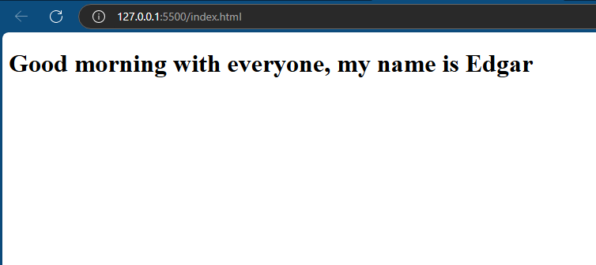

# Hello World in HTML and JavaScript

This is a simple "Hello World" example using HTML and JavaScript. The project demonstrates how to create a basic HTML page that runs JavaScript to display a greeting message.

## Description

This project contains a basic HTML file with embedded JavaScript that displays a message "Hello World!" when the page is loaded. It showcases the use of HTML for structuring the page and JavaScript for interactivity.

## Features

- Basic HTML structure.
- Simple JavaScript to display a greeting message.
- No dependencies or frameworks required.

## Prerequisites

You don't need any special prerequisites to run this project. All you need is:

- A web browser (Chrome, Firefox, Edge, etc.).

## Installation

### Clone the repository

```bash
git clone https://github.com/epgarzonr10/HelloWorld-js.git
cd HelloWorldJS
```
## Results
<p align="center">
  
</p>

## Successfully Deployed HTML and JavaScript Application on Railway

This project demonstrates how to deploy a simple "Hello World" example using HTML and JavaScript to Railway, showcasing a basic greeting message on the web.

### Deployment Results on Railway

The application has been successfully deployed to Railway and is accessible online. You can visit the live application using the following link:

[**Access the Application on Railway**](https://helloworld-js-production.up.railway.app/)

### Railway Results
<p align="center">
  
</p>

### Highlights of the Deployment

- **Live Application**: The HTML and JavaScript application is now hosted and running on Railway's cloud infrastructure, providing users with an interactive browsing experience.
- **Ease of Deployment**: Railway simplifies the hosting process, requiring minimal configuration and setup for static web pages.
